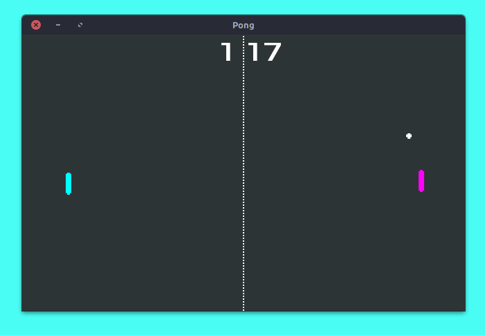

# Pong

this game is based from http://docs.godotengine.org/en/2.1/learning/step_by_step/simple_2d_game.html but using godot3 with score and music!

## Download
you can download it here -> https://github.com/indmind/pong/releases __linux only__, for windows, you can compile it yourself

## Screenshot

## License
Main music : https://www.dl-sounds.com/royalty-free/off-limits/

Pad hit    : https://www.freesoundeffects.com/free-track/tennisserve-468944/
